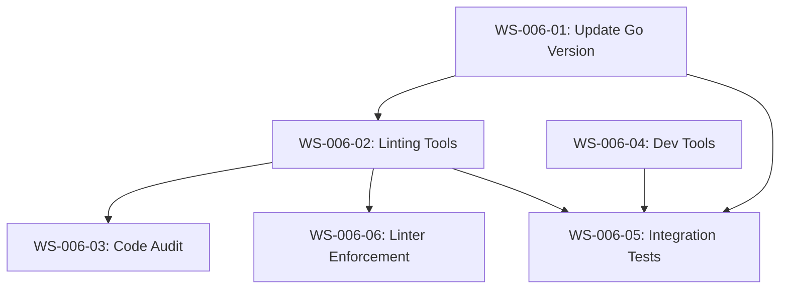

# Workstreams Index

## Feature F006: Go Modernization

**Goal**: Update Go version, tooling, and ensure code follows modern best practices.

### Workstreams

| WS ID | Title | Status | Dependencies | Scope | Estimated LOC |
|-------|-------|--------|--------------|-------|---------------|
| [WS-006-01](backlog/00-006-01.md) | Update Go Version and CI Configuration | backlog | Independent | SMALL | ~50 |
| [WS-006-02](backlog/00-006-02.md) | Add Modern Go Linting Tools | backlog | WS-006-01 | MEDIUM | ~100 |
| [WS-006-03](backlog/00-006-03.md) | Code Audit for Modern Go Best Practices | backlog | WS-006-02 | MEDIUM | Analysis only |
| [WS-006-04](backlog/00-006-04.md) | Update Development Tools and Security Audit | backlog | Independent | MEDIUM | ~100 |
| [WS-006-05](backlog/00-006-05.md) | Integration Tests and Build Verification | backlog | WS-006-01, WS-006-02, WS-006-04 | MEDIUM | ~200 |
| [WS-006-06](backlog/00-006-06.md) | Enforce Mandatory Linters and Fix Violations | backlog | WS-006-02 | MEDIUM | ~150 |

### Dependency Graph

### Execution Order

1. **WS-006-01**: Update Go version in CI and configurations (independent)
2. **WS-006-04**: Update development tools and security audit (parallel with #1)
3. **WS-006-02**: Add linting tools after Go version is updated
4. **WS-006-03**: Perform code audit using linting tools
5. **WS-006-06**: Enforce mandatory linters and fix violations (depends on #3)
6. **WS-006-05**: Final integration tests and build verification

### Notes

- WS-006-03 produces an audit report, not code changes. Subsequent workstreams may be created based on its recommendations.
- All workstreams are scoped SMALL or MEDIUM (<500 LOC changes).
- Feature ID F006 corresponds to "Go Modernization" initiative.